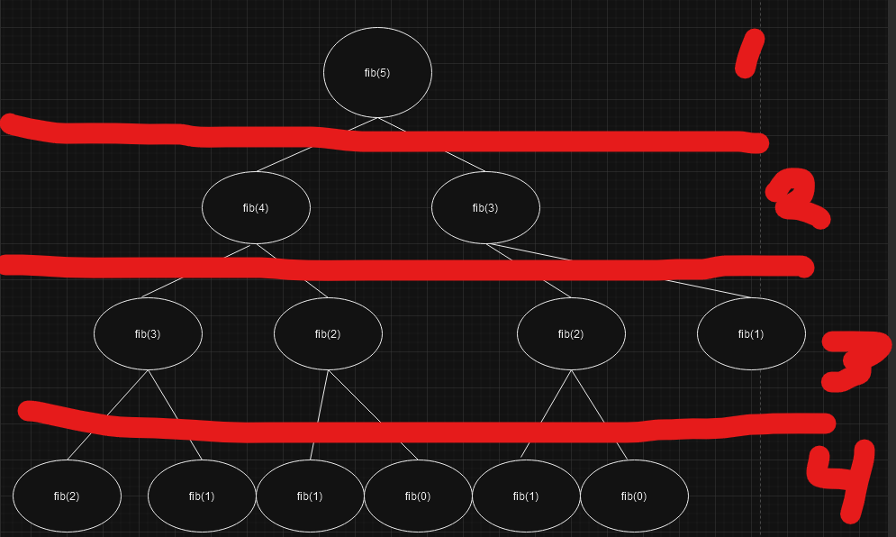
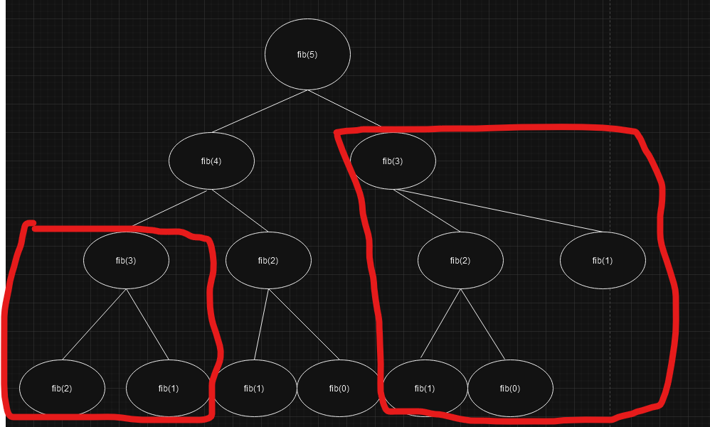
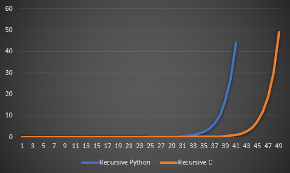
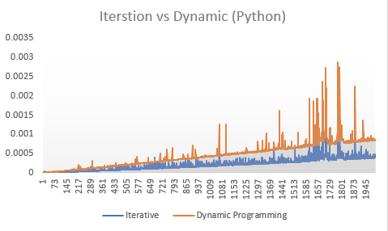
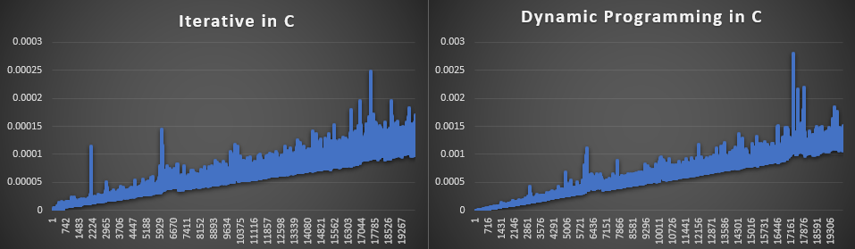

# Midterm p1: Report on Analysis of Fibonacci  Series
* **Author**: Bryce Dunlap
* **GitHub Repo**: [\[link to github repo with this report\]](https://github.com/Sp24-CS5008-Online-Lionelle/midterm-Bryce72)
* **Semester**: Spring 2024
* **Languages Used**: c, python

## Overview
***************************************************************************************************************************************************************************************
The goal of this project is to understand the fundamental differences in time complexity for the algorithm [Fibonacci Sequence]<sup>[1]</sup> by using C and python and to understand how to optimize our code for the best results. To give context, The fibonachi sequence is a series of numbers where each will take the sum of the two previous numbers. 

Here is what the 8th sequence in fibonaccis is: 0, 1, 1, 2, 3, 5, 8, 13
The mathmatical representation can be seen as:

$$F_n = F_{n-1} + F_{n-2}$$ 


with seed values of 
$$(F_0 = 0) (F_1 = 1)$$


[The Fibonacci sequence has been recorded since as early as 450 B.C.]<sup>[2]</sup> but first appeared in the book "Liber Abaci" (Translates to: The Book of Calculation) in the year 1202. Not only can the Fibonacci sequence be expressed in numbers but if you look hard enough, you can see the representation of the fibonacci sequence within nature aswell. 


There are multiple ways in which the fibonacci sequence can be represented in a programming language, which will be further discussed later in this report. The implementations that I will go over in this report are: Iterative, Reccursive and the dynamic programming approach. As represented for the big O values in the chart below.

| Version |  Big O | Space Used | 
| :-- | :-- |  :-- |
| Iterative | $O(n)$ | $O(n)$ |
| Recursive | $O(2^n)$  | $O(n)$ |
| Dynamic Programming | $O(n)$ | $O(n)$ |


A question that may come up is, Why is the recursive versions bigO $2^n$... And to explain that, it would be beneficial to visualize 



Notice how each level there will be more and more computations needed, making this recursive approach exponential.

There is also another important understanding to this visualization that is needed for the rest of this report. That is the repetition within a recursive fibonacci sequence. That can be seen in this picture below. (The highlighted marks are where computations are repeated)



This repition in recursion is what leads to the exponential rise in the time complexity.


Here is pseudocode to demonstrate recursion for the fibonacci sequence:
```text
    def fibonacci_recursion(n)
        if n <= 0 then
            return 0
        else if n == 1 then
            return 1
        else 
            return fibonacci(n -1) + fibonacci(n - 2)
```

Understanding that there is a subset of problems that repeat in the recursive approach is vital to knowing what to do when I was dynamically programming this. Specifically, we can use a technique called "memoization", which will optomize and speed up the program. However, there is a catch to using memoization, and that is it being a memory trade off. If you want a faster program, using memoization will mean more memory being used. 

Let me give a more formal definition of memoization:
[In computing, memoization is used to speed up computer programs by eliminating the repetitive computation of results, and by avoiding repeated calls to functions that process the same input.]<sup>[3]</sup>

Here is some pseudocode that shows memoization being applied:
```text
    def fibonacci_dynamic(n, storage)
        if n <= 0 then
            return 0
        else if n == 1 then
            return 1
        else if storage[n] is computed (that way we dont re compute it)
            return storage[n]
        else
            storage[n] = fibonacci(n - 1, storage) +fibonacci(n - 1, storage)
            return storage[n]
```

Using this technique will substantually increase the speed of our fibonacci function. Infact, making the growth in time to n value, linear but costing much more memory by using a "storage". 


Another approach in creating a function for the fibonacci sequence is using iteration. Iteration, like when we used memoization, will have a linear growth in time as n grows larger.
Iteration was the most effient method out of the three in this context of the fibonacci sequence due to its straightforward, low overhead approach that utilized minimal memory and avoids the complexities of  recursive calls. It was to my surprise that iteration beat my dynamically programmed function (but still grew in time at the same rate). This led me to thinking, where can using a dynamic program beat iteration? I found the answer to that question to be when problems become much more complex. A specific example of where dynamic programming could beat iteration is in the [Bellman-Ford Algorithm]<sup>[4]</sup>. It was important to me to include that example as it was a thought that came up too often when creating this report, but time to get back on topic and into the empirical data!

***************************************************************************************************************************************************************************************
## Empirical Data & Discussion 
For all of the data gathered, I used a python script to gather the data on my functions time complexity and operation count. It is programmed to max out at a 60 second time interval.([tester.py])

Below I will highlight both the operation count and speed for all algorithms.
#### Operations Comparison
| N  | Iterative | Dynamic Programming | Recursive |
|----|-----------|---------------------|-----------|
| 1  | 0         | 0                   | 0         |
| 2  | 1         | 1                   | 1         |
| 3  | 2         | 2                   | 2         |
| 4  | 3         | 3                   | 4         |
| 5  | 4         | 4                   | 7         |
| 6  | 5         | 5                   | 12        |
| 7  | 6         | 6                   | 20        |
| 8  | 7         | 7                   | 33        |
| 9  | 8         | 8                   | 54        |
| 10 | 9         | 9                   | 88        |
| 11 | 10        | 10                  | 143       |
| 12 | 11        | 11                  | 232       |
| 13 | 12        | 12                  | 376       |
| 14 | 13        | 13                  | 609       |
| 15 | 14        | 14                  | 986       |
| 16 | 15        | 15                  | 1596      |
| 17 | 16        | 16                  | 2583      |
| 18 | 17        | 17                  | 4180      |
| 19 | 18        | 18                  | 6764      |

The data gathered proves that both the dynamically programmed and iterative functions operations grew at a constant rate to n and the recursive functions operations grew at a massive increase of $$n^2$$ as expected. Both the c and the python language were equivalent in data gathered from the operation count. This is just a snippit of the data gathered. To see the full version, where I gathered values of up to n = 20000 click [here](ops_test.csv).


#### Recursive Versions



The y-axis shows the time in seconds and the x-axis shows the value of n.

The graph above shows in both C and python languages the recursive approach to the fibonacci sequence will result in an exponential rise in time. However, it appears to be quite efficient when n < 30. When n becomes > 30 you will see the python version will exponentially grow and the c version shows the same when n > 39, this is when the recursive algorithm becomes horribly inefficient at solving the fibonacci sequence.

#### Iterative and Dynamic Programming Versions

Since there is a huge increase in the speed efficientcy with iteration and dynamic programming, we can show some graphs with a much larger n value.





The graph above show the data gathered from when these algorithms were ran in python language. Both data points show a trend in linear growth. The iterative algorithm being faster than the dynamically programmed one on a case by case level, they do have a timing growth that generally grows at the same level. 


In C language we can also see the same linear growth in time trend. However, there is a more defined time difference between the two algorithms which is why you will see them in their own seperate graph. The time does in fact grow at the same rate but the difference in which it does that was more defined when compared to pythons version of these algorithms. 



## Language Analysis
The code writing can be found in these following files:
* [fibonacci_WORKS.c] -- implementation of functions in C
* [fibonacci_python.py] -- implementation of functions in Python
* [tester.py] -- Script used to push data gathered from these languages into a csv file.

The code written in these files were derived from provided examples written for pascals triangle (which you may see some reminiscence from if you see "pascal" in the code). Basically, I converted the already written pascals triangle functions into what is now fibonacci sequence functions.

### Language 1: C
Writing this code in C was challenging. However, after the code was written it gave me a more clear understanding as to the control C has. My inspirtation to these functions came from various resources like [Geeks for Geeks] <sup>5</sup>

A takeaway from writing this in C showed me just how large of a memory trade off there was for using memoization. 

```c 
static long fib_table[MAX];
```
MAX was defined to have a value of 50010, meaning I created an array to use for my memoization that had space for 50010 elements. To me that seemed like a HUGE amount of space to have allocated for this program. 

And to actually allocate the space I needed to initialize it within the main function by using a for loop:
```c    
for(int i = 0; i < MAX; i++)
    {
        fib_table[i] = -1;
    }
```
By setting each element in this "storage array" to -1 I was able to use dynamic programming to check if when there was a -1 shown in the array, to run the computation. 
Shown here:
```c 
else if(fib_table[n] != -1) <---------
    {
        return fib_table[n];
    }
    
    (*ops)++; 
    fib_table[n] = fibonacci_dp(n-1, ops) + fibonacci_dp(n-2, ops);
    return fib_table[n];
```
I was then able to return the value of the array at the nth position. 

The overall look at the program 

Another important aspect of coding this in C was the use of pointers. Specifically using ops. This granted me the ability to keep track of the operations it took to compute each function while still being able to efficiently return the nth value of each fibonacci sequence. 


The way I wrote the iteration version has a different return type than the other two functions. With iteration I was able to print out the whole sequence if wanted. By utilizing "row" which I stored on the heap. Later freed in the time calcuation function.

```c
ull fibonacci_iterative(int n, ull *ops)
{
    ull *row = malloc((sizeof(ull)) * (n + 1));
    //set base numbers
    if(n >= 0)
    {
        row[0] = 0;
    }
    if(n >= 1)
    {
        row[1] = 1;
    }

    for(int i = 2; i <= n; i++)
    {
        row[i] = row[i-1] + row[i-2];
        (*ops)++;
    }
    return row;
}
```


### Language 2: Python
The python version appeared to have less code, however things were as equivalent to the C version as I could make it, without the use of storing an array on the heap like I was able to do in C and making OPS a global variable.

```python
def recursive_fiboncai(n: int):
    global OPS
    if (n <= 0):
        return 0
    elif(n == 1):
        return 1
    else:
        OPS += 1
        return recursive_fiboncai(n - 1) + recursive_fiboncai(n - 2)
```

As you see in the recursive function, it is nearly the same as C but with the difference in how OPS was constructed, making it a global integer here. 
A really cool implemenation used in python was this:
```python 
sys.setrecursionlimit(100000)
```
This snippet sets the recursion limit to 100000 instead of the defaulted 1000. Meaning I could use these recursive calls for up to 100000 to avoid a stack overflow. 


### Comparison and Discussion Between Experiences
This was the part I was really looking forward to writing. There was what I felt a huge difference in writing this code between python and C. With the code in C it felt more complex, I had to keep track of certain things like when I allocated memory for row to be stored on the heap, I needed to make sure I free'd that memory up somewhere. With python there was no need to worry about things like that. Although, I didn't take advantage of some of these libraries, from research I saw there was a library in python that would basically compute the fibonacci sequence for you, which would save the headache of trying to figure out how to correctly write these functions, but would have taken away the understanding of how these fibonacci sequence functions even work, which is why I didn't use it. If I really wanted a fast program, say if I were a stock trade, then it is clear from the data gathered that using C would greatly increase the speed compared to python. But if I just wanted a basic program to use, say if I just wanted just a fun program to analyze an earnings report (that wouldn't need speed) then I would opt to use python instead, due to the simplicity of the code. I went down many avenues of learning when constructing this code in C as you can see a file in here that was not used within the report ([fibonacci_c.c]), where I explored the usage of using a cache (although not correctly implemented) and the complexity of making the time function. 

## Conclusions / Reflection
To conclude this report, it is important for me to mark down the topics that were learned during the process of writing this.

* Using recursion, iteration and dynamic programming
* Memoization and cache
* Just because iteration was the overall faster algorithm in this context does not mean it is for every problem.
* C was demonstrated to be faster than python
* Using memoization is great for speed but bad for memory
* recursion, although simple to code, can become extremely inefficient.

Admittedly, there was alot of room for improvement when writing the C code. Such as being able to compute the time each function took within one time function. This could have been done by using row, the same way I did with the iterative approach, to the recursive and dynamically programmed function. But due to having to submit this project in time, I opted for returning the nth value of the fibonacci sequence and creating an identicle yet seperate time function for both the dynamic programming function and the recursive function. 

Overall, this project gave me a clear understanding as to how different algorithms can be used, amongst different languages. Each having their own pros and cons, some use cases better or for worse.


## References
1. Imagination Station, "The Fibonacci Sequence" Imagination Station, Toledo’s Science Center, is the region’s resource in interactive Science, Technology, Engineering and Math (STEM) education. September 23, 2021.
2. Wikipedia, "Fibonacci sequence", February 22, 2024
3. GeeksforGeeks, "What is memoization? A Complete tutorial", Februrary 16th, 2024.A computer science portal for geeks. It contains well written, well thought and well explained computer science and programming articles, quizzes and practice/competitive programming/company interview Questions.
4. GeeksforGeeks, "Bellman–Ford Algorithm", Februrary 16th, 2024. A computer science portal for geeks. It contains well written, well thought and well explained computer science and programming articles, quizzes and practice/competitive programming/company interview Questions. 
5. GeeksforGeeks, "Fibonacci Series Program in C", Februrary 16th, 2024. A computer science portal for geeks. It contains well written, well thought and well explained computer science and programming articles, quizzes and practice/competitive programming/company interview Questions. 


<!-- auto references -->
[Fibonacci Sequence]: https://www.imaginationstationtoledo.org/about/blog/the-fibonacci-sequence
[The Fibonacci sequence has been recorded since as early as 450 B.C.]: https://en.wikipedia.org/wiki/Fibonacci_sequence
[In computing, memoization is used to speed up computer programs by eliminating the repetitive computation of results, and by avoiding repeated calls to functions that process the same input.]: https://www.geeksforgeeks.org/what-is-memoization-a-complete-tutorial/
[Bellman-Ford Algorithm]: https://www.geeksforgeeks.org/bellman-ford-algorithm-dp-23/
[tester.py]: tester.py
[here]: ops_test.csv
[Geeks for Geeks]: https://www.geeksforgeeks.org/c-fibonacci-series/
[fibonacci_WORKS.c]: fibonacci_WORKS.c
[fibonacci_python.py]: fibonacci_python.py
[fibonacci_c.c]: fibonacci_c.c
